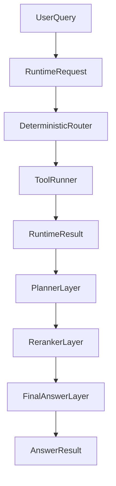

# Stage 6: Replaceable Planner / Reranker / Final Answer

## Context

Stage 5 baseline is complete and pushed:

- Deterministic router: `src/mr_norm/runtime/router.py`
- Tool runner + fusion: `src/mr_norm/runtime/tool_runner.py`
- Contracts: `src/mr_norm/runtime/contracts.py` (`RuntimeRequest`, `RuntimeResult`)
- CLI: `rag-runtime`, `rag-runtime-batch`
- Prompt assets (schema only): `planner_evidence_v1.json`, `final_answer_v1.json`
- Hardening tests: commit `c623963`

Retrieval tools (`point`, `payload`, `vector`) remain independent modules under `src/mr_norm/retrieval/tools/`. They must not call planner, reranker, or final answer.

## Goal

Add three **replaceable** post-retrieval layers that consume `RuntimeResult` and produce typed, serializable outputs. LLM implementations are optional backends behind stable interfaces; default CI path uses deterministic/no-LLM stubs.

## Layered Pipeline



**Boundary rule:** `run_runtime()` stops at `RuntimeResult`. Planner/reranker/final_answer never import retrieval tool runners or Qdrant adapters.

## Contracts (new modules)

### Shared

| Module | Responsibility |
|--------|----------------|
| `runtime/prompts.py` | Load/version prompt packs from `config/prompts/*.json`; validate role + `output_contract` |
| `runtime/pipeline.py` | Orchestrate `RuntimeResult` → planner → reranker → final_answer with injectable backends |

### Planner

- **Input:** `RuntimeRequest` + optional `RuntimeResult` (evidence snapshot for LLM planner)
- **Output:** `PlannerPlan` — `selected_tools`, `routing_reasons`, optional `filter_hints`, `schema_version: mr_planner_plan_v1`
- **Backends:**
  - `DeterministicPlanner` — delegates to existing `route_runtime()` (default, no LLM)
  - `PromptPackPlanner` — uses `planner_evidence_v1.json`; validates JSON against `output_contract`
- **Note:** LLM planner may *suggest* tools; execution still goes through `run_runtime()` with validated tool names only (`point`, `payload`, `vector`). Invalid suggestions become warnings, not silent tool calls.

### Reranker

- **Input:** `RuntimeResult.items` (+ query, profile)
- **Output:** `RerankResult` — ordered `RetrievedItem[]`, `scores`, `schema_version: mr_rerank_v1`
- **Backends:**
  - `PassthroughReranker` — preserve runtime order (default)
  - `ScoreReranker` — deterministic sort by existing item scores / tool priority
  - `PromptPackReranker` — stub for future LLM; requires new asset `config/prompts/reranker_evidence_v1.json`
- **Prompt asset to add:** `reranker_evidence_v1.json` with `role: reranker`, `required_fields: ["ranked_chunk_ids"]`

### Final answer

- **Input:** query + reranked evidence (`RetrievedItem[]`)
- **Output:** `FinalAnswerResult` — `answer`, `citations[]` with `chunk_id`, `doc_name`, `point_number`; `schema_version: mr_final_answer_v1`
- **Backends:**
  - `EvidenceOnlyFinalAnswer` — markdown summary of top-N chunks, no LLM (default for tests/CLI)
  - `PromptPackFinalAnswer` — uses `final_answer_v1.json`; citation validator ensures every citation references an evidence `chunk_id`

### Citation validator

- `runtime/citations.py` — reject hallucinated `chunk_id` / `point_number` not present in evidence
- Shared by final answer and future `norm_lookup` skill

## File Layout (incremental)

```text
src/mr_norm/runtime/
  contracts.py          # extend with PlannerPlan, RerankResult, FinalAnswerResult, PipelineResult
  prompts.py            # load_prompt_pack(role), list_prompt_packs()
  planner.py            # Planner protocol + deterministic + prompt-pack stub
  reranker.py           # Reranker protocol + passthrough + score
  final_answer.py       # FinalAnswer protocol + evidence-only + prompt-pack stub
  citations.py          # validate_citations(evidence, citations)
  pipeline.py           # run_pipeline(request, config, *, planner, reranker, final_answer)
src/mr_norm/config/prompts/
  reranker_evidence_v1.json   # new
```

CLI (Stage 6b, after core modules):

- `rag-pipeline` — `run_runtime` + pipeline, JSON/markdown report
- Flags: `--planner deterministic|prompt`, `--reranker passthrough|score`, `--final-answer evidence|prompt`

## Test Strategy

| Area | Tests |
|------|-------|
| Prompt packs | Extend `test_prompt_pack_schema.py` (reranker asset) |
| Planner | Deterministic planner matches `route_runtime`; invalid LLM JSON → warnings |
| Reranker | Order preserved / score sort; empty evidence → empty result |
| Citations | Valid/invalid citation fixtures |
| Pipeline | End-to-end with mocked `run_runtime`; no Qdrant, no real LLM |
| Regression | Existing `test_runtime_*` unchanged; retrieval tool tests untouched |

Target: +25–35 tests, full suite stays green without live LLM or Qdrant rebuild.

## Implementation Order

1. **Contracts + prompts loader** — types and `prompts.py`; add `reranker_evidence_v1.json`
2. **Citations validator** — small, testable, blocks downstream hallucinations
3. **Reranker** — passthrough + score backends
4. **Planner** — deterministic wrapper over `route_runtime`
5. **Final answer** — evidence-only backend
6. **Pipeline orchestrator** — wire layers; unit tests with mocked runtime
7. **CLI `rag-pipeline`** — optional; reuse report helpers from `tool_runner.py`
8. **Prompt-pack LLM backends** — interface + stub that returns structured fixture JSON (no network in CI)

## Guardrails (unchanged)

- Do not edit files under `C:\Users\buleo\.cursor\plans`
- Do not modify old `rag_norm`
- No Qdrant rebuild for Stage 6
- No LLM inside `retrieval/tools/*`
- Planner LLM output is advisory until validated and executed via existing tool runner

## Success Criteria

- `python -m pytest -q` passes with deterministic defaults only
- `run_pipeline(...)` produces `PipelineResult` trace showing which backend ran each layer
- Citations in `FinalAnswerResult` always subset of `RuntimeResult.items`
- Ready for Stage 7 (`norm_lookup` skill) as thin wrapper over `run_pipeline`

## References

- Overall roadmap: `planning/overall_plan.md` (Stage 5 → planner/reranker/final answer; Stage 6 skills)
- Baseline commits: `9113433` (runtime), `c623963` (hardening tests)
